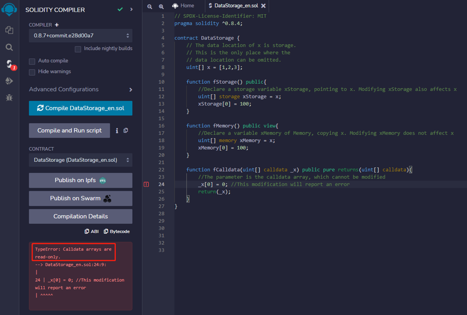
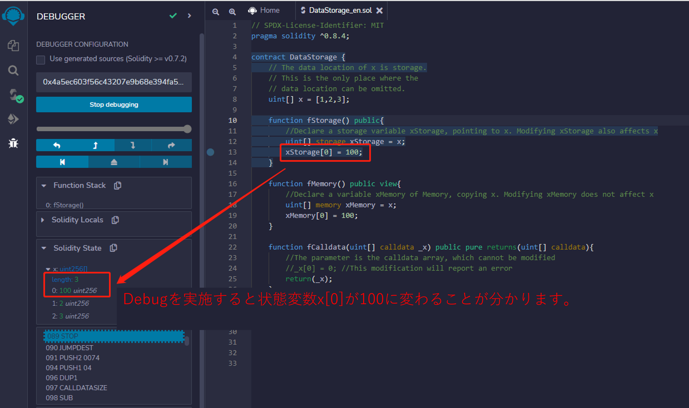
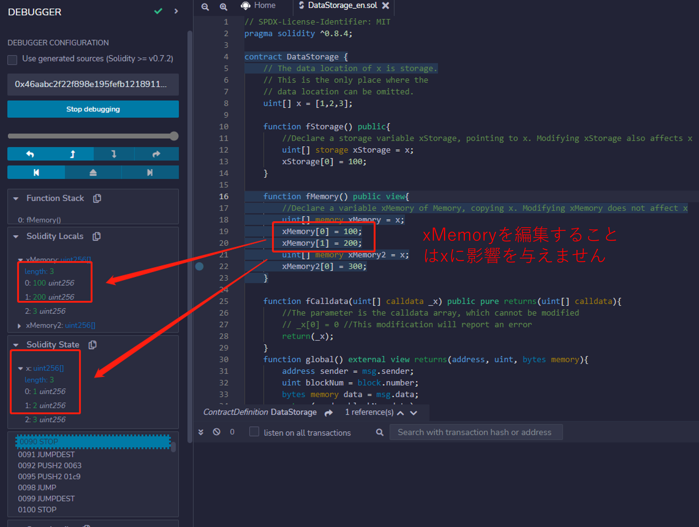
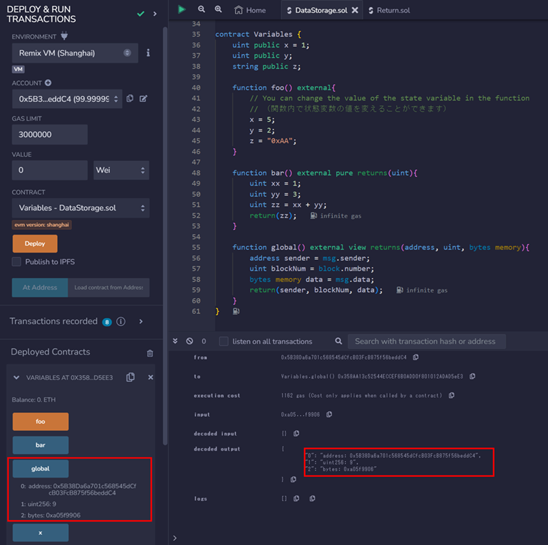
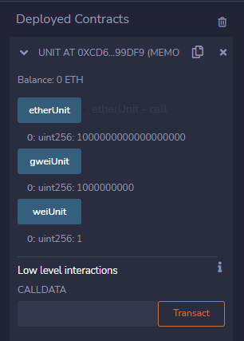
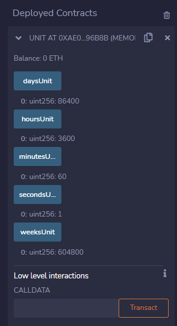

# WTF Solidity 超シンプル入門: 5. Data Storage and Scope（データ保存とスコープ）

最近、Solidity の学習を再開し、詳細を確認しながら「Solidity 超シンプル入門」を作っています。これは初心者向けのガイドで、プログラミングの達人向けの教材ではありません。毎週 1〜3 レッスンのペースで更新していきます。

僕のツイッター：[@0xAA_Science](https://twitter.com/0xAA_Science)｜[@WTFAcademy\_](https://twitter.com/WTFAcademy_)

コミュニティ：[Discord](https://discord.gg/5akcruXrsk)｜[Wechat](https://docs.google.com/forms/d/e/1FAIpQLSe4KGT8Sh6sJ7hedQRuIYirOoZK_85miz3dw7vA1-YjodgJ-A/viewform?usp=sf_link)｜[公式サイト wtf.academy](https://wtf.academy)

すべてのソースコードやレッスンは github にて公開: [github.com/AmazingAng/WTFSolidity](https://github.com/AmazingAng/WTFSolidity)

-----

## Solidityの参照型
**参照型（Reference Type）**: 参照型はそれ自体に直接的に値を保存することが無いという点において、値型とは異なっています。その代わりに、参照型はデータの場所のアドレスやポインタを保存し、データを直接共有することはありません。異なる変数名で基礎的なデータを変更することが出来ます。参照型には`array`や`struct`、そして`mapping`があり、そしてそれは沢山の保存領域を確保します。参照型を用いる時にはデータ領域の場所を扱う必要があります。

## Data location（データ保存場所）
Solidityにおけるデータ保存場所については、３つの種類があります: `storage`や`memory`、そして`calldata`です。ガス代は各保存場所によって異なっています。 

`storage`変数のデータはオンチェーン（コンピューターにおけるハードディスクに似ています）に保存され、沢山の`gas`を消費します; 一方で`memory`と`calldata`変数のデータは一時的にメモリーに保存され、消費される`gas`は比較的少ないです。

一般的な使用方法:

1. `storage`: 状態変数はデフォルトで`storage`です。そしてオンチェーンに保存されます。 

2. `memory`: 関数における引数や一時変数というのは`memory`ラベルが使用され、メモリーに保存されますが、オンチェーンに保存されません。特に、文字列、バイト、配列、カスタム構造体など、戻り値のデータ型が可変長の場合は、メモリを追加する必要があります。

3. `calldata`: `memory`に似ており、メモリーに保存され、オンチェーンには保存されません。`memory`との違いは`calldata`変数は編集出来ません。そして一般的に関数の引数に使用されます。使用例を見てみましょう:

```solidity
    function fCalldata(uint[] calldata _x) public pure returns(uint[] calldata){
        //The parameter is the calldata array, which cannot be modified.
        //（引数はcalldateの配列であり、書き換えることはできません）
        // _x[0] = 0 //This modification will report an error.（この書き換えはエラーを吐きます）
        return(_x);
    }
```

**Example:**


### Data location and assignment behaviour（データ格納場所と代入の挙動）

データ格納場所はデータの永続性に関係するだけでなく、代入のセマンティクスにも関係します。

1. `storage`（コントラクトの状態変数）がローカルの`storage`（関数にあるもの）に代入される時、参照は生成され、新しい変数の値の変更はオリジナルの変数の値に影響を与えることになります。使用例を見てみましょう:
```solidity
    uint[] x = [1,2,3]; // state variable: array x

    function fStorage() public{
        // Declare a storage variable xStorage, pointing to x. Modifying xStorage will also affect x
        //（格納変数xStorageを宣言し、xを指しています。xStorageを編集することはxにも影響を与えます。）
        uint[] storage xStorage = x;
        xStorage[0] = 100;
    }
```
**Example:**


2. `storage`を`memory`に代入することは独立したコピーを生成します。そして一方への変更というものはもう片方に影響を与えることはありません;逆もまた同様です。使用例を見てみましょう:
```solidity
    uint[] x = [1,2,3]; // state variable: array x
    
    function fMemory() public view{
        // Declare a variable xMemory of Memory, copy x. Modifying xMemory will not affect x
        //（Memoryの変数xMemoryを宣言し、xをコピーしています。xMemoryを編集することはxには影響を与えません。）
        uint[] memory xMemory = x;
        xMemory[0] = 100;
    }
```
**Example:**


3. `memory`を`memory`に代入することは参照を生成します。そして新しい変数への変更はオリジナルの変数に影響を与えます。

4. 一方で変数を`storage`に代入することは、独立したコピーを生成します。そして片方に変更を加えることはもう片方に影響を与えることはありません。

## Variable scope（変数スコープ）
`Solidity`にはそのスコープによると３つのタイプの変数があります: 状態変数、ローカル変数、そしてグローバル変数です。

### 1. State variables（状態変数）
状態変数はそのデータがオンチェーンに保存される変数であり、コントラクト内の関数によってアクセスできるものですが、その`gas`消費量は大きいです。

状態変数はコントラクト内と関数の外部で宣言されます:
```solidity
contract Variables {
    uint public x = 1;
    uint public y;
    string public z;
```

関数における状態変数の値を変更することが可能です:

```solidity
    function foo() external{
        // You can change the value of the state variable in the function
        //（関数内の状態変数の値を変更することが可能である）
        x = 5;
        y = 2;
        z = "0xAA";
    }
```

### 2. Local variable（ローカル変数）
ローカル変数は関数の実行中にのみ有効な変数です; 処理が関数から抜けた後には無効になります。ローカル変数のデータはメモリーに保存され、オンチェーンには保存されません。そして`gas`消費量は小さいです。

ローカル変数は関数内で宣言されます:
```solidity
    function bar() external pure returns(uint){
        uint xx = 1;
        uint yy = 3;
        uint zz = xx + yy;
        return(zz);
    }
```

### 3. Global variable（グローバル変数）
グローバル変数はグローバルスコープで動作する変数であり、`solidity`の予約キーワードです。宣言することなく直接的に関数内で使用することが出来ます:

```solidity
    function global() external view returns(address, uint, bytes memory){
        address sender = msg.sender;
        uint blockNum = block.number;
        bytes memory data = msg.data;
        return(sender, blockNum, data);
    }
```
上の例では、３つのグローバル変数を使用しています: `msg.sender`、`block.number`、そして`msg.data`です。そしてそれはそれぞれ、メッセージ（現在実行中の関数呼び出し）の送り主(エンティティ(アドレス))を表し、現在のブロックの高さ（その関数が含まれるトランザクションが含まれるブロックの番号。スマートコントラクトがブロックチェーン上でどの位置にあるかを把握するのに役立つ）を表し、また完全なるcalldata（スマートコントラクトの関数を外部から呼び出す際に含まれるデータが格納される場所）を表しています。総じて、関数呼び出しにまつわるコンテキスト情報を提供しています。

下に挙げているのはいくつかの一般的に使われるグローバル変数です:
Below are some commonly used global variables:

- `blockhash(uint blockNumber)`: (`bytes32`)         指定されたブロックのハッシュ - 最も直近の256ブロックにのみ適用される 
- `block.coinbase`             : (`address payable`) 現在のブロック採掘者（マイナー）のアドレス
- `block.gaslimit`             : (`uint`)            現在のブロックのガスリミット（ネットワークが設定するブロックに許可されるガスの最大量）
- `block.number`               : (`uint`)            現在のブロックナンバー
- `block.timestamp`            : (`uint`)            現在のブロックのタイムスタンプ。「UNIXエポック」（1970年1月1日午前0時0分0秒）からの経過秒数
- `gasleft()`                  : (`uint256`)         残りのガス
- `msg.data`                   : (`bytes calldata`)  完全なるcalldata
- `msg.sender`                 : (`address payable`) メッセージの送り主 (現在実行中関数の呼び出し主)
- `msg.sig`                    : (`bytes4`)          calldataの最初の４バイト (すなわち関数の識別子)
- `msg.value`                  : (`bytes4`)          メッセージで送られるweiの数（ETHの量:wei単位）

**Example:**



### 4. グローバル変数 - イーサリアムの単位と時間の単位

**イーサリアムの単位**

小数点は`Solidity`には存在せず、トランザクションの正確さを保証し、精度の損失を防ぐために`0`に置き換えられます。イーサリアムの単位の使用により、計算ミスの問題が回避され、プログラマーはコントラクトで通貨トランザクションを簡単に処理できます。

- `wei`: 1
- `gwei`: 1e9 = 1000000000
- `ether`: 1e18 = 1000000000000000000

```solidity
    function weiUnit() external pure returns(uint) {
        assert(1 wei == 1e0);
        assert(1 wei == 1);
        return 1 wei;
    }

    function gweiUnit() external pure returns(uint) {
        assert(1 gwei == 1e9);
        assert(1 gwei == 1000000000);
        return 1 gwei;
    }

    function etherUnit() external pure returns(uint) {
        assert(1 ether == 1e18);
        assert(1 ether == 1000000000000000000);
        return 1 ether;
    }
```

**Example:**



**時間の単位**

コントラクトの中で、あるオペレーションを1週間以内に完了させるとか、あるイベントが1ヶ月後に発生するといった指定が可能です。 これにより、コントラクトの実行をより正確に行うことができ、技術的なエラーによってコントラクトの結果に影響を与えることはありません。 したがって、時間単位は Solidity の重要な概念であり、契約の可読性と保守性の向上に役立ちます。

- `seconds`: 1
- `minutes`: 60 seconds = 60
- `hours`: 60 minutes = 3600
- `days`: 24 hours = 86400
- `weeks`: 7 days = 604800

```solidity
    function secondsUnit() external pure returns(uint) {
        assert(1 seconds == 1);
        return 1 seconds;
    }

    function minutesUnit() external pure returns(uint) {
        assert(1 minutes == 60);
        assert(1 minutes == 60 seconds);
        return 1 minutes;
    }

    function hoursUnit() external pure returns(uint) {
        assert(1 hours == 3600);
        assert(1 hours == 60 minutes);
        return 1 hours;
    }

    function daysUnit() external pure returns(uint) {
        assert(1 days == 86400);
        assert(1 days == 24 hours);
        return 1 days;
    }

    function weeksUnit() external pure returns(uint) {
        assert(1 weeks == 604800);
        assert(1 weeks == 7 days);
        return 1 weeks;
    }
```

**Example:**



## まとめ
この章では、`solidity`における参照型、データ保存場所と変数スコープを紹介しました。データ保存場所には３種類あります: `storage`、`memory`、そして`calldata`です。ガスコストは保存場所毎に異なっています。変数スコープには状態変数、ローカル変数、そしてグローバル変数があります。

